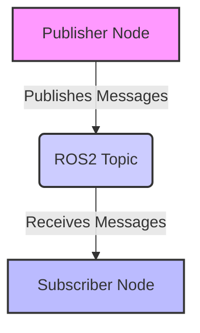

# Chapter 1: Introduction to ROS2

## What is ROS2?

ROS2 (Robot Operating System 2) is a flexible framework for writing robot software. It's a collection of tools, libraries, and conventions that aim to simplify the task of creating complex and robust robot behavior across a wide variety of robotic platforms.

### Key Concepts

*   **Nodes**: Independent processes that perform computations. Each node should be responsible for a single module purpose (e.g., a camera driver, a motor controller).
*   **Topics**: A named bus over which nodes exchange messages. Data is published on a topic by one node and subscribed to by other nodes.
*   **Messages**: Structured data types used for communication between nodes over topics.
*   **Services**: A request/reply mechanism for communication between nodes. A client sends a request, and a service processes it and returns a response.
*   **Actions**: A higher-level abstraction for long-running tasks, providing feedback and the ability to cancel the goal.

## Why ROS2?

ROS2 addresses many of the challenges in robotics development:

*   **Modularity**: Breaking down complex systems into smaller, manageable nodes.
*   **Reusability**: Sharing code and tools across different robot projects.
*   **Communication**: Providing robust mechanisms for inter-process communication.
*   **Community Support**: A large and active global community contributes to its development and provides support.

## Setting Up Your ROS2 Environment

Before you can start developing with ROS2, you need to set up your environment. This typically involves installing ROS2 distributions (e.g., Foxy, Galactic, Humble) on a compatible operating system like Ubuntu.

For this book, we will assume an Ubuntu 20.04 (Focal Fossa) or Ubuntu 22.04 (Jammy Jellyfish) environment with a recent ROS2 distribution (e.g., Humble).

```bash
sudo apt update
sudo apt install software-properties-common
sudo add-apt-repository universe
sudo apt install curl
sudo curl -sSL https://raw.githubusercontent.com/ros/rosdistro/master/ros.key -o /usr/share/keyrings/ros-archive-keyring.gpg
echo "deb [arch=$(dpkg --print-architecture) signed-by=/usr/share/keyrings/ros-archive-keyring.gpg] http://packages.ros.org/ros2/ubuntu $(. /etc/os-release && echo UBUNTU_CODENAME) main" | sudo tee /etc/apt/sources.list.d/ros2.list > /dev/null
sudo apt update
sudo apt upgrade
sudo apt install ros-humble-desktop # For Humble on Ubuntu 22.04
# For Foxy on Ubuntu 20.04: sudo apt install ros-foxy-desktop
```

After installation, remember to source your ROS2 environment:

```bash
source /opt/ros/humble/setup.bash
```

This chapter has provided a foundational understanding of ROS2. In the next chapter, we will delve deeper into ROS2 workspaces and creating your first ROS2 package.

## ROS2 Node Communication Diagram


This diagram illustrates a fundamental communication pattern in ROS2: a `Publisher Node` sends `Messages` to a `ROS2 Topic`, and a `Subscriber Node` receives those `Messages` from the same `Topic`.

## Exercise 1.1: Verifying Your ROS2 Installation and Exploring the Environment

This exercise will guide you through verifying your ROS2 installation and exploring the basic elements of a running ROS2 system.

**Objective:**
- Confirm that your ROS2 environment is correctly set up.
- Learn how to list active ROS2 topics and nodes.

**Instructions:**

1.  **Verify ROS2 Environment Setup:**
    Open a new terminal and type the following command to check if your ROS2 environment variables are sourced correctly. You should see output related to `ROS_DISTRO`, `ROS_VERSION`, `ROS_PACKAGE_PATH`, etc.

    ```bash
    printenv | grep ROS
    ```

    *Expected Output:* You should see several lines starting with `ROS_`, indicating that your ROS2 environment is active. If you see no output, ensure you have sourced your ROS2 setup file (e.g., `source /opt/ros/humble/setup.bash` or `source install/setup.bash` if installed from source).

2.  **Start a ROS2 Demo Node:**
    To have something to interact with, let's start a basic ROS2 demo node. Open a **new terminal** (keep your first terminal open) and run:

    ```bash
    ros2 run turtlesim turtlesim_node
    ```
    This will launch the `turtlesim` simulation window.

3.  **List Active ROS2 Topics:**
    Switch back to your **first terminal** and use the following command to list all currently active ROS2 topics. These are the channels through which nodes communicate.

    ```bash
    ros2 topic list
    ```

    *Expected Output:* You should see topics like `/turtle1/cmd_vel`, `/turtle1/pose`, `/rosout`, etc., which are created by the `turtlesim_node`.

4.  **List Active ROS2 Nodes:**
    In the same terminal, list all active ROS2 nodes. Nodes are the executables that perform computation in a ROS2 graph.

    ```bash
    ros2 node list
    ```

    *Expected Output:* You should see at least `/turtlesim` and `/ros2cli_your_process_id` (or similar for the command-line interface).

**Questions to Consider (Self-Reflection):**

*   What is the purpose of the `/rosout` topic?
*   Can you infer the purpose of `/turtle1/cmd_vel` and `/turtle1/pose` topics based on their names?
*   If you close the `turtlesim` window, what happens when you run `ros2 node list` or `ros2 topic list` again?

This exercise helps you confirm your ROS2 setup and introduces you to the core concepts of topics and nodes in a practical way.