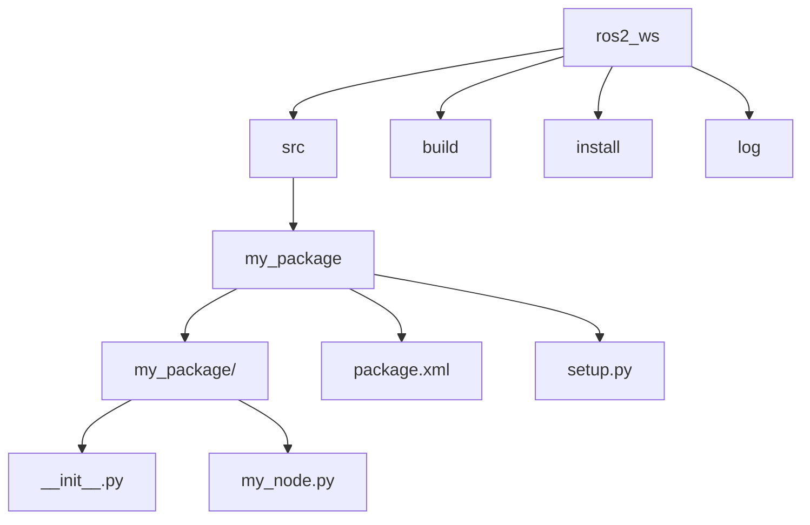

# Chapter 2: ROS2 Workspaces and Your First Package

## Understanding ROS2 Workspaces

A ROS2 workspace is a directory on your file system where you can store, build, and install ROS2 packages. It's similar to a development environment where all your related projects live. Using a workspace helps manage dependencies and ensures that your custom packages can be found by the ROS2 system.

### Key Directories in a Workspace

When you create and build a ROS2 workspace, you'll typically find these directories:

*   **`src/`**: This is where you place the source code of your ROS2 packages. Each sub-directory within `src/` usually represents a different ROS2 package.
*   **`build/`**: This directory is created by the build system (e.g., Colcon) and stores intermediate build files.
*   **`install/`**: This directory contains the installed files of your packages, including executables, libraries, and configuration files. It's structured similarly to a standard Linux installation directory, with `bin`, `lib`, `share`, etc.
*   **`log/`**: Contains log files generated during the build process.

## Creating Your First ROS2 Workspace

Let's create a simple workspace for our robotics projects.

1.  **Create the workspace directory:**

    ```bash
    mkdir -p ~/ros2_ws/src
    ```

    The `-p` flag ensures that parent directories are created if they don't already exist.

2.  **Navigate into the workspace:**

    ```bash
    cd ~/ros2_ws
    ```

3.  **Build the empty workspace (optional but good practice):**

    ```bash
    colcon build
    ```

    `colcon` is the recommended build tool for ROS2. Building an empty workspace initializes the `build`, `install`, and `log` directories.

4.  **Source the workspace:**

    ```bash
    source install/setup.bash
    ```

    Sourcing the workspace's `setup.bash` file (or `setup.zsh` for Zsh, `setup.ps1` for PowerShell) adds your workspace's packages to the ROS2 environment, making them discoverable. You'll need to do this every time you open a new terminal or add new packages.

## Creating Your First ROS2 Package

Now that we have a workspace, let's create a simple package inside it. A ROS2 package is the fundamental unit of software organization in ROS2, containing nodes, libraries, configuration files, and more.

We'll use `ros2 pkg create` to generate a new package.

1.  **Navigate to the `src` directory of your workspace:**

    ```bash
    cd ~/ros2_ws/src
    ```

2.  **Create a new package:**

    ```bash
    ros2 pkg create --build-type ament_python my_robot_pkg
    ```

    *   `--build-type ament_python`: Specifies that this will be a Python package using the `ament` build system. For C++ packages, you would use `--build-type ament_cmake`.
    *   `my_robot_pkg`: The name of your new package.

    This command creates a new directory `my_robot_pkg` inside `src/` with a basic structure, including `package.xml` (metadata) and `setup.py` (build configuration for Python).

3.  **Examine the package structure:**

    ```bash
    ls my_robot_pkg
    ```

    You'll see files like `package.xml`, `setup.py`, and a `resource` directory.

4.  **Build your new package:**

    ```bash
    cd ~/ros2_ws
    colcon build --packages-select my_robot_pkg
    ```

    `--packages-select my_robot_pkg` tells `colcon` to only build this specific package, which can save time in larger workspaces.

5.  **Source your workspace again:**

    After building new packages, you *must* re-source your workspace to make the new packages available in your current terminal session.

    ```bash
    source install/setup.bash
    ```

Congratulations! You've successfully created your first ROS2 workspace and package. In the next chapter, we'll start writing our first ROS2 nodes to make our robot perform actions.



### Exercise: Creating Your First ROS2 Workspace and Package

**Goal:** Understand the fundamental structure of a ROS2 workspace by creating one, and then create a simple Python package within it.

**Steps:**

1.  **Create a new ROS2 workspace directory:**
    ```bash
    mkdir -p ~/dev_ws/src
    cd ~/dev_ws
    ```

2.  **Initialize the workspace:**
    While typically not strictly necessary for an empty workspace, it's good practice to ensure `src` is recognized.
    ```bash
    touch src/COLCON_IGNORE # If you had other files you wanted to ignore. This isn't strictly needed for an empty src.
    ```

3.  **Create a new Python package:**
    Use `ros2 pkg create` to create a new Python package named `my_package` within the `src` directory.
    ```bash
    cd src
    ros2 pkg create --build-type ament_python my_package
    ```
    This will create a directory `my_package` with a basic `package.xml` and `setup.py` inside it.

4.  **Add a simple Python file (optional but good practice):**
    Navigate into your new package and create a simple Python file.
    ```bash
    cd my_package
    mkdir my_package
    echo "def main():\
    print('Hello from my_package!')\
\
if __name__ == '__main__':\
    main()" > my_package/my_node.py
    ```

5.  **Build the workspace:**
    Go back to the root of your workspace (`~/dev_ws`) and build it using `colcon build`.
    ```bash
    cd ~/dev_ws
    colcon build
    ```
    This command will process your `my_package` and create the `build`, `install`, and `log` directories.

6.  **Source the workspace:**
    To make your new package visible to ROS2, you need to source the `setup.bash` (or `setup.ps1` for Windows, `setup.zsh` for Zsh) file from your workspace's `install` directory.
    ```bash
    . install/setup.bash
    ```
    *(Note: If you are using Zsh, replace `setup.bash` with `setup.zsh`. If using PowerShell on Windows, use `install\\setup.ps1`)*

7.  **Verify package creation:**
    Now, check if ROS2 can find your package.
    ```bash
    ros2 pkg list | grep my_package
    ```

**Expected Output for Step 7:**

```
my_package
```

**Explanation:**
- `ros2_ws`: This is the root of your ROS2 workspace.
- `src`: This directory contains the source code for your ROS2 packages.
- `build`: This directory stores intermediate files generated during the build process.
- `install`: This directory contains the final compiled and installed files, including executables and libraries.
- `log`: This directory contains logs from the build process.
- `my_package`: An example ROS2 Python package within the `src` directory.

---