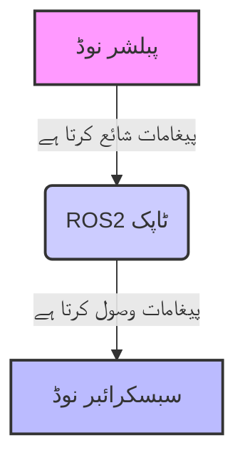

# باب 1: ROS2 کا تعارف

## ROS2 کیا ہے؟

ROS2 (Robot Operating System 2) روبوٹ سافٹ ویئر لکھنے کے لیے ایک لچکدار فریم ورک ہے۔ یہ ٹولز، لائبریریوں اور کنونشنز کا ایک مجموعہ ہے جس کا مقصد روبوٹک پلیٹ فارمز کی ایک وسیع رینج میں پیچیدہ اور مضبوط روبوٹ رویے کو بنانے کے کام کو آسان بنانا ہے۔

### کلیدی تصورات

*   **نوڈز**: آزادانہ عمل جو حسابات انجام دیتے ہیں۔ ہر نوڈ کو ایک ماڈیول کے واحد مقصد کا ذمہ دار ہونا چاہیے (مثلاً، ایک کیمرہ ڈرائیور، ایک موٹر کنٹرولر)۔
*   **ٹاپکس**: ایک نامی بس جس پر نوڈز پیغامات کا تبادلہ کرتے ہیں۔ ڈیٹا ایک نوڈ کے ذریعے ایک ٹاپک پر شائع کیا جاتا ہے اور دوسرے نوڈز کے ذریعے سبسکرائب کیا جاتا ہے۔
*   **پیغامات**: ٹاپکس پر نوڈز کے درمیان مواصلت کے لیے استعمال ہونے والی منظم ڈیٹا کی اقسام۔
*   **سروسز**: نوڈز کے درمیان مواصلت کے لیے ایک درخواست/جواب کا طریقہ کار۔ ایک کلائنٹ ایک درخواست بھیجتا ہے، اور ایک سروس اس پر کارروائی کرتی ہے اور ایک جواب واپس کرتی ہے۔
*   **ایکشنز**: لمبے عرصے تک چلنے والے کاموں کے لیے ایک اعلیٰ سطح کا خلاصہ، جو فیڈ بیک فراہم کرتا ہے اور مقصد کو منسوخ کرنے کی صلاحیت رکھتا ہے۔

## ROS2 کیوں؟

ROS2 روبوٹکس ڈویلپمنٹ میں بہت سے چیلنجوں سے نمٹتا ہے:

*   **ماڈیولریٹی**: پیچیدہ سسٹمز کو چھوٹے، قابل انتظام نوڈز میں توڑنا۔
*   **دوبارہ استعمال**: مختلف روبوٹ پروجیکٹس میں کوڈ اور ٹولز کا اشتراک۔
*   **مواصلت**: عمل کے درمیان مواصلت کے لیے مضبوط میکانزم فراہم کرنا۔
*   **کمیونٹی سپورٹ**: ایک بڑی اور فعال عالمی کمیونٹی اس کی ترقی میں معاونت کرتی ہے اور سپورٹ فراہم کرتی ہے۔

## اپنا ROS2 ماحول ترتیب دینا

ROS2 کے ساتھ ڈویلپمنٹ شروع کرنے سے پہلے، آپ کو اپنا ماحول ترتیب دینے کی ضرورت ہے۔ اس میں عام طور پر Ubuntu جیسے ہم آہنگ آپریٹنگ سسٹم پر ROS2 ڈسٹری بیوشنز (مثلاً، Foxy, Galactic, Humble) انسٹال کرنا شامل ہے۔

اس کتاب کے لیے، ہم ایک Ubuntu 20.04 (Focal Fossa) یا Ubuntu 22.04 (Jammy Jellyfish) ماحول کو ایک حالیہ ROS2 ڈسٹری بیوشن (مثلاً، Humble) کے ساتھ فرض کریں گے۔

```bash
sudo apt update
sudo apt install software-properties-common
sudo add-apt-repository universe
sudo apt install curl
sudo curl -sSL https://raw.githubusercontent.com/ros/rosdistro/master/ros.key -o /usr/share/keyrings/ros-archive-keyring.gpg
echo "deb [arch=$(dpkg --print-architecture) signed-by=/usr/share/keyrings/ros-archive-keyring.gpg] http://packages.ros.org/ros2/ubuntu $(. /etc/os-release && echo UBUNTU_CODENAME) main" | sudo tee /etc/apt/sources.list.d/ros2.list > /dev/null
sudo apt update
sudo apt upgrade
sudo apt install ros-humble-desktop # For Humble on Ubuntu 22.04
# For Foxy on Ubuntu 20.04: sudo apt install ros-foxy-desktop
```

انسٹالیشن کے بعد، اپنے ROS2 ماحول کو سورس کرنا یاد رکھیں:

```bash
source /opt/ros/humble/setup.bash
```

اس باب نے ROS2 کی بنیادی سمجھ فراہم کی ہے۔ اگلے باب میں، ہم ROS2 ورک اسپیسز اور اپنا پہلا ROS2 پیکیج بنانے کے بارے میں مزید گہرائی میں جائیں گے۔

## ROS2 نوڈ کمیونیکیشن ڈایاگرام


یہ ڈایاگرام ROS2 میں ایک بنیادی مواصلاتی نمونہ کی وضاحت کرتا ہے: ایک `پبلشر نوڈ` `پیغامات` کو ایک `ROS2 ٹاپک` پر بھیجتا ہے، اور ایک `سبسکرائبر نوڈ` اسی `ٹاپک` سے وہ `پیغامات` وصول کرتا ہے۔

## مشق 1.1: اپنی ROS2 انسٹالیشن کی تصدیق اور ماحول کی کھوج

یہ مشق آپ کو اپنی ROS2 انسٹالیشن کی تصدیق کرنے اور چل رہے ROS2 سسٹم کے بنیادی عناصر کو تلاش کرنے میں رہنمائی کرے گی۔

**مقصد:**
- تصدیق کریں کہ آپ کا ROS2 ماحول صحیح طریقے سے ترتیب دیا گیا ہے۔
- فعال ROS2 ٹاپکس اور نوڈز کی فہرست کیسے بنائیں یہ سیکھیں۔

**ہدایات:**

1.  **ROS2 ماحولیاتی سیٹ اپ کی تصدیق کریں:**
    ایک نیا ٹرمینل کھولیں اور درج ذیل کمانڈ ٹائپ کریں تاکہ یہ چیک کیا جا سکے کہ آیا آپ کے ROS2 ماحولیاتی متغیرات صحیح طریقے سے سورس کیے گئے ہیں۔ آپ کو `ROS_DISTRO`، `ROS_VERSION`، `ROS_PACKAGE_PATH` وغیرہ سے متعلق آؤٹ پٹ نظر آنا چاہیے۔

    ```bash
    printenv | grep ROS
    ```

    *متوقع آؤٹ پٹ:* آپ کو `ROS_` سے شروع ہونے والی کئی لائنیں نظر آنی چاہئیں، جو یہ ظاہر کرتی ہیں کہ آپ کا ROS2 ماحول فعال ہے۔ اگر آپ کو کوئی آؤٹ پٹ نظر نہیں آتا ہے، تو یقینی بنائیں کہ آپ نے اپنی ROS2 سیٹ اپ فائل کو سورس کیا ہے (مثلاً، `source /opt/ros/humble/setup.bash` یا اگر سورس سے انسٹال کیا گیا ہے تو `source install/setup.bash`)۔

2.  **ایک ROS2 ڈیمو نوڈ شروع کریں:**
    کسی ایسی چیز کے ساتھ تعامل کرنے کے لیے، آئیے ایک بنیادی ROS2 ڈیمو نوڈ شروع کریں۔ ایک **نیا ٹرمینل** کھولیں (اپنا پہلا ٹرمینل کھلا رکھیں) اور چلائیں:

    ```bash
    ros2 run turtlesim turtlesim_node
    ```

    یہ `turtlesim` سمولیشن ونڈو لانچ کرے گا۔

3.  **فعال ROS2 ٹاپکس کی فہرست بنائیں:**
    اپنے **پہلے ٹرمینل** پر واپس جائیں اور تمام فی الحال فعال ROS2 ٹاپکس کی فہرست بنانے کے لیے درج ذیل کمانڈ کا استعمال کریں۔ یہ وہ چینلز ہیں جن کے ذریعے نوڈز بات چیت کرتے ہیں۔

    ```bash
    ros2 topic list
    ```

    *متوقع آؤٹ پٹ:* آپ کو `/turtle1/cmd_vel`، `/turtle1/pose`، `/rosout` وغیرہ جیسے ٹاپکس نظر آنے چاہئیں، جو `turtlesim_node` کے ذریعے بنائے گئے ہیں۔

4.  **فعال ROS2 نوڈز کی فہرست بنائیں:**
    اسی ٹرمینل میں، تمام فعال ROS2 نوڈز کی فہرست بنائیں۔ نوڈز وہ ایگزیکیوٹیبل ہیں جو ROS2 گراف میں حسابات انجام دیتے ہیں۔

    ```bash
    ros2 node list
    ```

    *متوقع آؤٹ پٹ:* آپ کو کم از کم `/turtlesim` اور `/ros2cli_your_process_id` (یا کمانڈ لائن انٹرفیس کے لیے اسی طرح کا) نظر آنا چاہیے۔

**غور کرنے کے لیے سوالات (خود عکاسی):**

*   `/rosout` ٹاپک کا مقصد کیا ہے؟
*   کیا آپ `/turtle1/cmd_vel` اور `/turtle1/pose` ٹاپکس کا مقصد ان کے ناموں کی بنیاد پر اخذ کر سکتے ہیں؟
*   اگر آپ `turtlesim` ونڈو بند کرتے ہیں، تو جب آپ دوبارہ `ros2 node list` یا `ros2 topic list` چلاتے ہیں تو کیا ہوتا ہے؟

یہ مشق آپ کو اپنے ROS2 سیٹ اپ کی تصدیق کرنے میں مدد دیتی ہے اور آپ کو عملی طریقے سے ٹاپکس اور نوڈز کے بنیادی تصورات سے متعارف کراتی ہے۔
