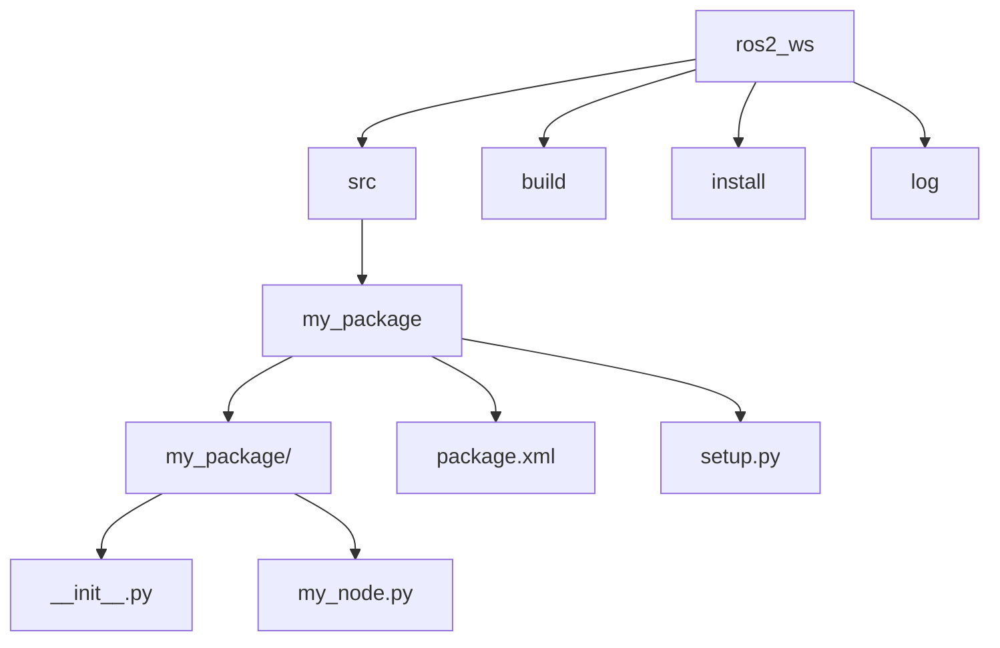

# باب 2: ROS2 ورک اسپیسز اور آپ کا پہلا پیکیج

## ROS2 ورک اسپیسز کو سمجھنا

ایک ROS2 ورک اسپیس آپ کے فائل سسٹم پر ایک ڈائریکٹری ہے جہاں آپ ROS2 پیکیجز کو اسٹور، بلڈ، اور انسٹال کر سکتے ہیں۔ یہ ایک ترقیاتی ماحول کی طرح ہے جہاں آپ کے تمام متعلقہ پروجیکٹس رہتے ہیں۔ ورک اسپیس کا استعمال انحصار کو منظم کرنے میں مدد کرتا ہے اور یقینی بناتا ہے کہ آپ کے کسٹم پیکیجز کو ROS2 سسٹم کے ذریعے تلاش کیا جا سکے۔

### ورک اسپیس میں کلیدی ڈائریکٹریز

جب آپ ایک ROS2 ورک اسپیس بناتے اور بلڈ کرتے ہیں، تو آپ کو عام طور پر یہ ڈائریکٹریز ملیں گی:

*   **`src/`**: یہ وہ جگہ ہے جہاں آپ اپنے ROS2 پیکیجز کا سورس کوڈ رکھتے ہیں۔ `src/` کے اندر ہر سب ڈائریکٹری عام طور پر ایک مختلف ROS2 پیکیج کی نمائندگی کرتی ہے۔
*   **`build/`**: یہ ڈائریکٹری بلڈ سسٹم (جیسے کولکن) کے ذریعے بنائی جاتی ہے اور انٹرمیڈیٹ بلڈ فائلوں کو اسٹور کرتی ہے۔
*   **`install/`**: اس ڈائرکٹری میں آپ کے پیکیجز کی انسٹال کردہ فائلیں شامل ہوتی ہیں، بشمول ایگزیکیوٹیبلز، لائبریریز، اور کنفیگریشن فائلز۔ یہ ایک معیاری لینکس انسٹالیشن ڈائریکٹری کی طرح بنائی گئی ہے، جس میں `bin`، `lib`، `share` وغیرہ شامل ہیں۔
*   **`log/`**: بلڈ کے عمل کے دوران تیار کردہ لاگ فائلز شامل ہوتی ہیں۔

## اپنا پہلا ROS2 ورک اسپیس بنانا

آئیے اپنے روبوٹکس پروجیکٹس کے لیے ایک سادہ ورک اسپیس بناتے ہیں۔

1.  **ورک اسپیس ڈائریکٹری بنائیں:**

    ```bash
    mkdir -p ~/ros2_ws/src
    ```

    `-p` فلیگ یقینی بناتا ہے کہ پیرنٹ ڈائریکٹریاں بنائی جائیں اگر وہ پہلے سے موجود نہیں ہیں۔

2.  **ورک اسپیس میں جائیں:**

    ```bash
    cd ~/ros2_ws
    ```

3.  **خالی ورک اسپیس بلڈ کریں (اختیاری لیکن اچھی عادت):**

    ```bash
    colcon build
    ```

    `colcon` ROS2 کے لیے تجویز کردہ بلڈ ٹول ہے۔ ایک خالی ورک اسپیس کو بلڈ کرنے سے `build`، `install`، اور `log` ڈائریکٹریاں شروع ہوتی ہیں۔

4.  **ورک اسپیس سورس کریں:**

    ```bash
    source install/setup.bash
    ```

    ورک اسپیس کی `setup.bash` فائل (یا Zsh کے لیے `setup.zsh`، پاور شیل کے لیے `setup.ps1`) کو سورس کرنے سے آپ کے ورک اسپیس کے پیکیجز ROS2 ماحول میں شامل ہو جاتے ہیں، جس سے وہ قابل دریافت ہو جاتے ہیں۔ آپ کو ہر بار ایک نیا ٹرمینل کھولنے یا نئے پیکیجز شامل کرنے پر ایسا کرنے کی ضرورت ہوگی۔

## اپنا پہلا ROS2 پیکیج بنانا

اب جب کہ ہمارے پاس ایک ورک اسپیس ہے، آئیے اس کے اندر ایک سادہ پیکیج بناتے ہیں۔ ایک ROS2 پیکیج ROS2 میں سافٹ ویئر تنظیم کی بنیادی اکائی ہے، جس میں نوڈز، لائبریریز، کنفیگریشن فائلز، اور بہت کچھ شامل ہوتا ہے۔

ہم ایک نیا پیکیج بنانے کے لیے `ros2 pkg create` استعمال کریں گے۔

1.  **اپنے ورک اسپیس کی `src` ڈائریکٹری میں جائیں:**

    ```bash
    cd ~/ros2_ws/src
    ```

2.  **ایک نیا پیکیج بنائیں:**

    ```bash
    ros2 pkg create --build-type ament_python my_robot_pkg
    ```

    *   `--build-type ament_python`: یہ بتاتا ہے کہ یہ `ament` بلڈ سسٹم کا استعمال کرتے ہوئے ایک پائتھون پیکیج ہوگا۔ C++ پیکیجز کے لیے، آپ `--build-type ament_cmake` استعمال کریں گے۔
    *   `my_robot_pkg`: آپ کے نئے پیکیج کا نام۔

    یہ کمانڈ `src/` کے اندر ایک نئی ڈائریکٹری `my_robot_pkg` بناتی ہے جس میں ایک بنیادی ڈھانچہ ہوتا ہے، جس میں `package.xml` (میٹا ڈیٹا) اور `setup.py` (پائتھون کے لیے بلڈ کنفیگریشن) شامل ہیں۔

3.  **پیکیج ڈھانچہ کا جائزہ لیں:**

    ```bash
    ls my_robot_pkg
    ```

    آپ کو `package.xml`، `setup.py`، اور ایک `resource` ڈائریکٹری جیسی فائلیں نظر آئیں گی۔

4.  **اپنے نئے پیکیج کو بلڈ کریں:**

    ```bash
    cd ~/ros2_ws
    colcon build --packages-select my_robot_pkg
    ```

    `--packages-select my_robot_pkg` `colcon` کو صرف اس مخصوص پیکیج کو بلڈ کرنے کے لیے کہتا ہے، جو بڑے ورک اسپیسز میں وقت بچا سکتا ہے۔

5.  **اپنے ورک اسپیس کو دوبارہ سورس کریں:**

    نئے پیکیجز کو بلڈ کرنے کے بعد، آپ کو اپنے ورک اسپیس کو دوبارہ سورس کرنا *ضروری* ہے تاکہ نئے پیکیجز آپ کے موجودہ ٹرمینل سیشن میں دستیاب ہوں۔

    ```bash
    source install/setup.bash
    ```

    مبارک ہو! آپ نے کامیابی سے اپنا پہلا ROS2 ورک اسپیس اور پیکیج بنا لیا ہے۔ اگلے باب میں، ہم اپنے روبوٹ کو اعمال انجام دینے کے لیے اپنے پہلے ROS2 نوڈز لکھنا شروع کریں گے۔



### مشق: اپنا پہلا ROS2 ورک اسپیس اور پیکیج بنانا

**مقصد:** ایک ROS2 ورک اسپیس کی بنیادی ساخت کو سمجھنا، اسے بنا کر، اور پھر اس کے اندر ایک سادہ پائتھون پیکیج بنانا۔

**اقدامات:**

1.  **ایک نئی ROS2 ورک اسپیس ڈائریکٹری بنائیں:**
    ```bash
    mkdir -p ~/dev_ws/src
    cd ~/dev_ws
    ```

2.  **ورک اسپیس کو شروع کریں:**
    اگرچہ خالی ورک اسپیس کے لیے عام طور پر سختی سے ضروری نہیں ہوتا، `src` کی پہچان کو یقینی بنانا اچھی عادت ہے۔
    ```bash
    touch src/COLCON_IGNORE # اگر آپ کے پاس دوسری فائلیں ہیں جنہیں آپ نظر انداز کرنا چاہتے ہیں۔ یہ خالی src کے لیے سختی سے ضروری نہیں ہے۔
    ```

3.  **ایک نیا پائتھون پیکیج بنائیں:**
    `ros2 pkg create` کا استعمال کرتے ہوئے `src` ڈائریکٹری کے اندر `my_package` نامی ایک نیا پائتھون پیکیج بنائیں۔
    ```bash
    cd src
    ros2 pkg create --build-type ament_python my_package
    ```
    یہ `my_package` نامی ایک ڈائریکٹری بنائے گا جس میں ایک بنیادی `package.xml` اور `setup.py` شامل ہوں گے۔

4.  **ایک سادہ پائتھون فائل شامل کریں (اختیاری لیکن اچھی عادت):**
    اپنے نئے پیکیج میں جائیں اور ایک سادہ پائتھون فائل بنائیں۔
    ```bash
    cd my_package
    mkdir my_package
    echo "def main():\
    print('Hello from my_package!')\
\
    if __name__ == '__main__':\
    main()" > my_package/my_node.py
    ```

5.  **ورک اسپیس بلڈ کریں:**
    اپنے ورک اسپیس کے روٹ (`~/dev_ws`) پر واپس جائیں اور اسے `colcon build` کا استعمال کرتے ہوئے بلڈ کریں۔
    ```bash
    cd ~/dev_ws
    colcon build
    ```
    یہ کمانڈ آپ کے `my_package` کو پروسیس کرے گی اور `build`، `install`، اور `log` ڈائریکٹریاں بنائے گی۔

6.  **ورک اسپیس کو سورس کریں:**
    اپنے نئے پیکیج کو ROS2 کے لیے مرئی بنانے کے لیے، آپ کو اپنے ورک اسپیس کی `install` ڈائریکٹری سے `setup.bash` (یا ونڈوز کے لیے `setup.ps1`، Zsh کے لیے `setup.zsh`) فائل کو سورس کرنا ہوگا۔
    ```bash
    . install/setup.bash
    ```
    *(نوٹ: اگر آپ Zsh استعمال کر رہے ہیں، تو `setup.bash` کو `setup.zsh` سے تبدیل کریں۔ اگر ونڈوز پر پاور شیل استعمال کر رہے ہیں، تو `install\\\\setup.ps1` استعمال کریں)*

7.  **پیکیج کی تخلیق کی تصدیق کریں:**
    اب، چیک کریں کہ کیا ROS2 آپ کا پیکیج تلاش کر سکتا ہے۔
    ```bash
    ros2 pkg list | grep my_package
    ```

**اقدام 7 کے لیے متوقع آؤٹ پٹ:**

```
my_package
```

**وضاحت:**
- `ros2_ws`: یہ آپ کے ROS2 ورک اسپیس کا روٹ ہے۔
- `src`: اس ڈائریکٹری میں آپ کے ROS2 پیکیجز کا سورس کوڈ شامل ہوتا ہے۔
- `build`: یہ ڈائریکٹری بلڈ کے عمل کے دوران تیار کردہ انٹرمیڈیٹ فائلوں کو اسٹور کرتی ہے۔
- `install`: اس ڈائرکٹری میں حتمی کمپائل شدہ اور انسٹال کردہ فائلیں شامل ہوتی ہیں، بشمول ایگزیکیوٹیبلز اور لائبریریز۔
- `log`: اس ڈائرکٹری میں بلڈ کے عمل سے لاگز شامل ہوتے ہیں۔
- `my_package`: `src` ڈائریکٹری کے اندر ایک ROS2 پائتھون پیکیج کی مثال۔
